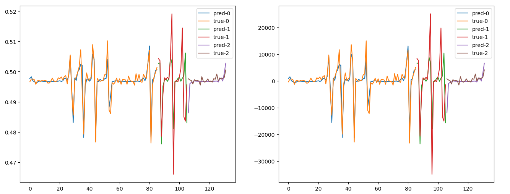
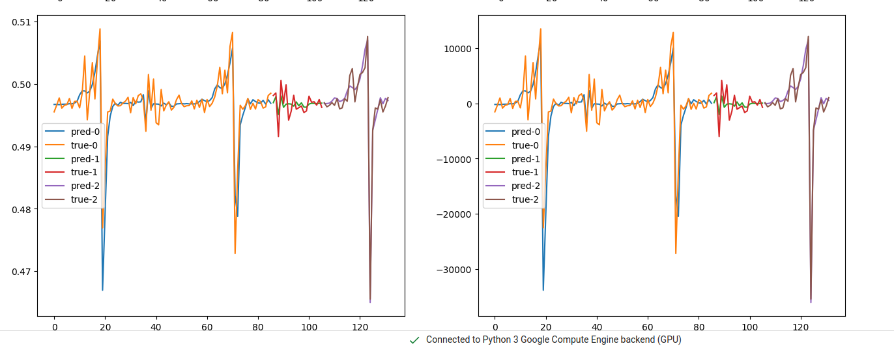

# walmart-analysis

[Presentation (PowerPoint)](docs/presentation.pptx)

[Presentation (PDF)](docs/presentation.pdf)

LSTM Example 1



LSTM Example 2



# Requirements

* conda (anaconda etc'...) - for manage the python envrioment

# Technologies

* poetry - for managing the python packages. Only python, pip and poetry are installed by conda.
* jupyter-lab - for runing jupyter notebooks in the browser

# Install

```bash
conda env create -f environment.yml
conda activate urinakysis-analysis
poetry install
```

# Get Started

Activate the conda envrioment using the IDE or in the terminal before running the next commands in this README:

```bash
conda activate urinakysis-analysis
```

For running the code

```bash
python -m src
```

Or for opening jupyter

```bash
jupyter-lab
```

Or just for opening python

```bash
python
```

## CI (Formaters and Linters)

For running the Formaters for clean the code. Run in the terminal:

```bash
make fix
```

For running the Linters for check the code. Run in the terminal:

```bash
make lint
```

For running the Formaters and Linters for clean and check the code. Run in the terminal:

```bash
make fix-lint
```

List of the Formaters and Linters:

* black - for format the code
* isort - for sort and clean the imports
* flake8 - for check the code according to PEP8
* mypy - for static type checking


For removeing the cache. Run in the terminal:

```bash
make clean
```

In practice, you dont need to run this command, it called by the other make commands.

# License

MIT License

# Authors

* Lior Shiboli
* Omer Priel
